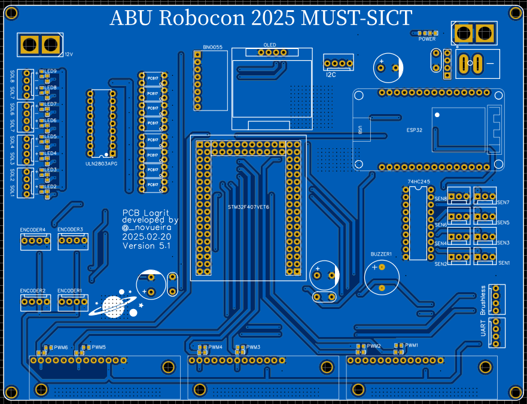

# ABU Robocon 2026 — Robot Firmware

Багийн **хоёр роботын** STM32F407 firmware-ийг нэг репод (monorepo) агуулна.
Хоёул **нэг ижил PCB** дээр ажиллах ба PS5 контроллероор (ESP32 Bluetooth
гүүрээр дамжуулан) удирдана.

## Бүтэц

| Фолдер | Робот | Тайлбар |
|--------|-------|---------|
| [`Robot1_Code/`](Robot1_Code) | **Гар удирдлагатай** | PS5-аар differential (tank) жолоодлого |
| [`Robot2_Code/`](Robot2_Code) | **Автомат** | gyro (LPMS), sequence, red/blue автомат угсралт |
| [`ps5_esp32_bridge/`](ps5_esp32_bridge) | *(хоёуланд нийтлэг)* | ESP32 PS5→UART гүүр (Arduino) |
| [`hardware/`](hardware) | *(нийтлэг)* | PCB (EasyEDA) схем / зураг |

## Систем (архитектур)

```
PS5 pad ──BT──▶ ESP32 (ps5_esp32_bridge) ──23 байт / 100 Hz UART──▶ STM32F407
                                                            (Robot1 эсвэл Robot2)
```

ESP32 гүүр PS5-ийн джойстик/товчийг 23 байтын packet болгож STM32 руу илгээнэ.
STM32 тал `control_data[5][4]`-д задалж, өөрийн удирдлагадаа ашиглана.

## Тоног төхөөрөмж

- **MCU:** STM32F407 (хоёр роботод ижил PCB)
- **Контроллер:** PS5 → ESP32 (Bluetooth) → UART (USART3)
- **Дэлгэц:** SSD1306 OLED (I2C2)
- **IMU (зөвхөн Robot2):** LPMS-BE2 (UART4)
- **Мотор:** 6 × DC (encoder-тэй), серво, brush, соленоид

## PCB

Хоёр робот **нэг ижил PCB** дээр угсрагдсан (EasyEDA дээр зурсан).
Схем/зургийг [`hardware/`](hardware) дотор хадгална (зураг нэмэгдэхэд доор харагдана):



## Build

Робот бүр тусдаа CMake төсөл. Тухайн фолдерт нь ороод:

```
cmake --preset Debug
cmake --build --preset Debug
```

VS Code дээр **хоёуланг зэрэг нээх:** `ABU_Robocon_2026.code-workspace`
(File → Open Workspace from File…). Status bar-аас идэвхтэй project-оо
сонгож build/debug хийнэ.

## ESP32 гүүр

[`ps5_esp32_bridge/`](ps5_esp32_bridge) — Arduino IDE-гээр ESP32-д ачаална
(STM32 build-д ороогүй). Packet-ийн бүтцийг файл дотор дэлгэрэнгүй тайлбарласан.
